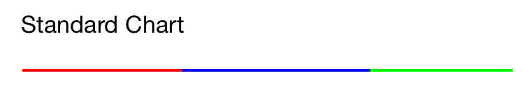

# StackedBarChart
StackedBarChart for iOS written in swift

##What does it do?
Basically it is a class, which helps you to make better barcharts. <br />
This is what a StackedBarChart looks like: <br />
 <br/>
The Bar is divided into different segments, which is perfect to compare different things, e.g. the budget for projects.

##How to use?
My StackedBarChart is very simple (that was the goal) and is very easy to use (the other goal :)). <br />
Just instaciate a new StackedBarChart:
```
let chart = StackedBarChart(frame: CGRectMake(x, y, width, height)) //Height is always 2
let chart = StackedBarChart(frame: CGRectMake(x, y, width, height), forceHeight: true) //You can choose the height
```
I recommend using the first one, because it automatically sets the height to 2. <br/>
This is also the height of a UIProgessView and match the Design Guidelines from Apple.
<br/><br/>
Then add as many segments as you like to you Chart like this:
```
let segment = BarSegment(value: floatValue, color: someColor) //Creates a Segment with a speciefied value and color
chart.addSegment(segment) // Adds the segment to the chart

let segment1 = BarSegment(EmptySegmentWithvalue: floatValue) //Creates a Empty Segment
chart.addSegment(segment1) // Adds the segment to the chart
```

Here you see there are two different inits. The first one creates a standard Segment with a color as you like. The second one creates an "empty segment". This means the Color is a light gray and the isEmpty-flag is setted. This means, that this segment is ignored when you sort the segments. You can change the color and the isEmpty manually for both. <br/>
And last:
```
chart.draw() /*or*/ chart.drawSorted()
view.addSubview(chart)
```
The last step is to tell the chart, that it should draw it self. The Segments are drawn in the given order from left to right. With the second method you can tell the chart it should sort the segments by value. The Empty Segments are ignored at sorting, as said above. And the end add the chart to a superview.
